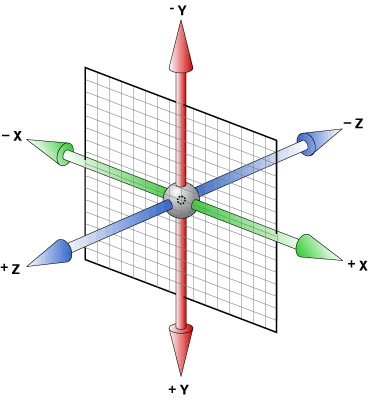

# 3D 视图

## `perspective`

`perspective` 指定了观察者与 z=0 平面的距离，使具有三维位置变换的元素产生透视效果。z>0 的三维元素比正常大，而 z<0 时则比正常小，大小程度由该属性的值决定。

> 语法

```css
/* Keyword value */
perspective: none;

/* <length> values */
perspective: 20px;
perspective: 3.5em;

/* Global values */
perspective: inherit;
perspective: initial;
perspective: unset;
```

## `transform-style`

`transform-style` 设置元素的子元素是位于 3D 空间中还是平面中。

> 语法

```css
/* Keyword values */
transform-style: flat;
transform-style: preserve-3d;

/* Global values */
transform-style: inherit;
transform-style: initial;
transform-style: unset;
```

## 示例，画一个立方体

> 首先要给 3D 的元素准备一个“舞台”
> 因为页面本身是平面的，并不能展示出 3D 的效果。所以通过设置透视距离，把这个”舞台“变成了一个能表现出近大远小的“3D 舞台”，在其内部就可以去做 3D 效果了。

```html livecode
<style>
  .scene {
    height: 300px;
    background: #ddd;
    perspective: 300px; /* 设置透视距离 */
  }
</style>
<div class="scene"></div>
```

> 然后在舞台中加入一个盒子来做立方体，给盒子设置宽高并放置到`舞台`中央，并添加边框以便可以观察位置，然后设置`transform-style: preserve-3d;`（允许盒子里的子元素进行 3D 变换）

```html livecode
<style>
  .scene {
    height: 300px;
    background: #ddd;
    perspective: 300px; /* 设置透视距离 */
    position: relative;
  }
  .box {
    width: 200px;
    height: 200px;
    position: absolute;
    top: 50%;
    left: 50%;
    transform: translate(-50%, -50%);
    border: 1px solid #000;
    transform-style: preserve-3d;
  }
</style>
<div class="scene">
  <div class="box"></div>
</div>
```

> 添加盒子的 6 个面，并将六个面都定位到 box 的正中心，设置宽高，并把文本居中

```html livecode
<style>
  .scene {
    height: 300px;
    background: #ddd;
    perspective: 300px; /* 设置透视距离 */
    position: relative;
  }
  .box {
    width: 200px;
    height: 200px;
    position: absolute;
    top: 50%;
    left: 50%;
    transform: translate(-50%, -50%);
    border: 1px solid #000;
    transform-style: preserve-3d;
  }
  .face {
    width: 200px;
    height: 200px;
    position: absolute;
    text-align: center;
    line-height: 200px;
    font-size: 30px;
  }
  .front {
    background: rgba(255, 204, 0, 0.5); // #ffcc00;
  }
  .back {
    background: rgba(181, 195, 0, 0.5); // #b5c300;
  }
  .left {
    background: rgba(105, 181, 21, 0.5); // #69b515;
  }
  .right {
    background: rgba(0, 162, 55, 0.5); // #00a237;
  }
  .up {
    background: rgba(0, 141, 81, 0.5); // #008d51;
  }
  .down {
    background: rgba(0, 118, 100, 0.5); // #007664;
  }
</style>
<div class="scene">
  <div class="box">
    <div class="face front">前</div>
    <div class="face back">后</div>
    <div class="face left">左</div>
    <div class="face right">右</div>
    <div class="face up">上</div>
    <div class="face down">下</div>
  </div>
</div>
```

> 如下图，x 轴表示左右，y 轴表示上下，z 轴表示前后（表示视觉上与我们的距离远近）
> 

> 现在每个面的宽高都是 200px，那么每个面应该朝对应的方向移动 100px。我们先来看`前`面和`后`面，`前`面应该朝 z 轴正方向移动 100px，`后`面应该朝 z 轴负方向移动 100px，同时`后`面需要转向后面，即沿着 y 轴旋转 180 度;

```html livecode
<style>
  .scene {
    height: 300px;
    background: #ddd;
    perspective: 300px; /* 设置透视距离 */
    position: relative;
  }
  .box {
    width: 200px;
    height: 200px;
    position: absolute;
    top: 50%;
    left: 50%;
    transform: translate(-50%, -50%);
    border: 1px solid #000;
    transform-style: preserve-3d;
  }
  .face {
    width: 200px;
    height: 200px;
    position: absolute;
    text-align: center;
    line-height: 200px;
    font-size: 30px;
  }
  .front {
    background: rgba(255, 204, 0, 0.5); // #ffcc00;
    transform: translateZ(100px);
  }
  .back {
    background: rgba(181, 195, 0, 0.5); // #b5c300;
    transform: translateZ(-100px) rotateY(180deg);
  }
  .left {
    background: rgba(105, 181, 21, 0.5); // #69b515;
  }
  .right {
    background: rgba(0, 162, 55, 0.5); // #00a237;
  }
  .up {
    background: rgba(0, 141, 81, 0.5); // #008d51;
  }
  .down {
    background: rgba(0, 118, 100, 0.5); // #007664;
  }
</style>
<div class="scene">
  <div class="box">
    <div class="face front">前</div>
    <div class="face back">后</div>
    <div class="face left">左</div>
    <div class="face right">右</div>
    <div class="face up">上</div>
    <div class="face down">下</div>
  </div>
</div>
```

> 然后我们再来看`左`面和`右`面，`左`面应该朝 x 轴负方向移动 100px，`右`面应该朝 x 轴正方向移动 100px；而这两个面默认是朝向前面，所以还需要进行转向，`左`面需要沿着 y 轴旋转-90 度，`右`面需要沿着 y 轴旋转 90 度

> 最后我们来看`上`面和`下`面，`上`面应该朝 y 轴负方向移动 100px，`下`面应该朝 y 轴正方向移动 100px；同样这两个面默认是朝向前面，所以也需要进行转向，`上`面需要沿着 x 轴旋转 90 度，`下`面需要沿着 x 轴旋转-90 度

```html livecode
<style>
  .scene {
    height: 300px;
    background: #ddd;
    perspective: 300px; /* 设置透视距离 */
    position: relative;
  }
  .box {
    width: 200px;
    height: 200px;
    position: absolute;
    top: 50%;
    left: 50%;
    transform: translate(-50%, -50%);
    border: 1px solid #000;
    transform-style: preserve-3d;
  }
  .face {
    width: 200px;
    height: 200px;
    position: absolute;
    text-align: center;
    line-height: 200px;
    font-size: 30px;
  }
  .front {
    background: rgba(255, 204, 0, 0.5); // #ffcc00;
    transform: translateZ(100px);
  }
  .back {
    background: rgba(181, 195, 0, 0.5); // #b5c300;
    transform: translateZ(-100px) rotateY(180deg);
  }
  .left {
    background: rgba(105, 181, 21, 0.5); // #69b515;
    transform: translateX(-100px) rotateY(-90deg);
  }
  .right {
    background: rgba(0, 162, 55, 0.5); // #00a237;
    transform: translateX(100px) rotateY(90deg);
  }
  .up {
    background: rgba(0, 141, 81, 0.5); // #008d51;
    transform: translateY(-100px) rotateX(90deg);
  }
  .down {
    background: rgba(0, 118, 100, 0.5); // #007664;
    transform: translateY(100px) rotateX(-90deg);
  }
</style>
<div class="scene">
  <div class="box">
    <div class="face front">前</div>
    <div class="face back">后</div>
    <div class="face left">左</div>
    <div class="face right">右</div>
    <div class="face up">上</div>
    <div class="face down">下</div>
  </div>
</div>
```

> 立方体已经画好了，为了需要看度更清楚，我们去掉前面添加度边框，增加一点角度的倾斜, 并加上一个旋转动画

```html livecode
<style>
  @keyframes run {
    0% {
      transform: translate(-50%, -50%) rotateZ(10deg) rotateX(0deg) rotateY(0);
    }
    50% {
      transform: translate(-50%, -50%) rotateZ(10deg) rotateX(180deg) rotateY(
          180deg
        );
    }
    100% {
      transform: translate(-50%, -50%) rotateZ(10deg) rotateX(360deg) rotateY(
          360deg
        );
    }
  }
  .scene {
    height: 300px;
    background: #ddd;
    perspective: 300px; /* 设置透视距离 */
    position: relative;
  }
  .box {
    width: 200px;
    height: 200px;
    position: absolute;
    top: 50%;
    left: 50%;
    transform: translate(-50%, -50%) rotateZ(30deg) rotateY(-30deg);
    transform-style: preserve-3d;
    animation: run 5s linear;
    animation-iteration-count: infinite;
  }
  .face {
    width: 200px;
    height: 200px;
    position: absolute;
    text-align: center;
    line-height: 200px;
    font-size: 30px;
  }
  .front {
    background: rgba(255, 204, 0, 0.5); // #ffcc00;
    transform: translateZ(100px);
  }
  .back {
    background: rgba(181, 195, 0, 0.5); // #b5c300;
    transform: translateZ(-100px) rotateY(180deg);
  }
  .left {
    background: rgba(105, 181, 21, 0.5); // #69b515;
    transform: translateX(-100px) rotateY(-90deg);
  }
  .right {
    background: rgba(0, 162, 55, 0.5); // #00a237;
    transform: translateX(100px) rotateY(90deg);
  }
  .up {
    background: rgba(0, 141, 81, 0.5); // #008d51;
    transform: translateY(-100px) rotateX(90deg);
  }
  .down {
    background: rgba(0, 118, 100, 0.5); // #007664;
    transform: translateY(100px) rotateX(-90deg);
  }
</style>
<div class="scene">
  <div class="box">
    <div class="face front">前</div>
    <div class="face back">后</div>
    <div class="face left">左</div>
    <div class="face right">右</div>
    <div class="face up">上</div>
    <div class="face down">下</div>
  </div>
</div>
```
